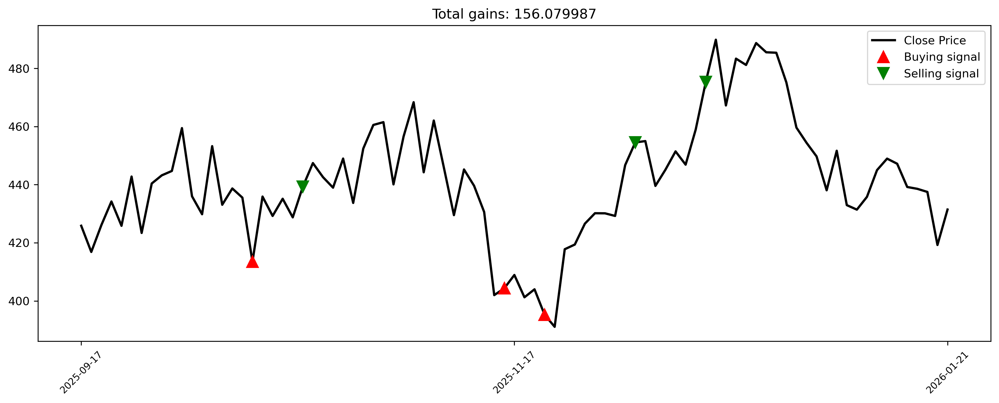

# 📈 Reinforcement Learning for Stock Trading using Double DQN

---
## 🚀 Overview
This project implements a Double Deep Q-Network (Double-DQN) reinforcement learning agent that learns to buy, hold, or sell stock using TSLA daily OHLCV data. The agent is trained to maximize realized PnL.

---
## 🧠 Key Features
- Rolling z‑score normalization of features
- Rolling‑window state encoding to capture short‑term market memory
- Full train/test pipeline on real TSLA stock data
- Replay buffer with randomized sampling to break temporal correlation and avoid memorizing noise
- Epsilon-greedy exploration with controlled decay schedule for exploration-exploitation balance
- Exponential learning-rate decay for stable convergence
- Gradient clipping to avoid exploding gradients
- Target network updates for Double DQN stability
- Transaction‑cost‑aware reward function

---
## 🎮 Action Space
| Action | Meaning |
|--------|----------|
| 0 | Hold |
| 1 | Buy |
| 2 | Sell |

---
### **Test Performance**

⚠️ Important Note: The performance figure shown above comes from a more advanced private version of the model that includes additional proprietary features, tuned hyperparameters, and extended reward shaping. For confidentiality reasons, that full version is not included in this repository. The public code is intended for demonstration purposes only.
